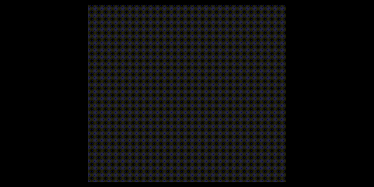

# Fourier Transform
I do not know if this is Fourier transform. Inspired from https://www.youtube.com/watch?v=spUNpyF58BY.

## How it works
The wave that is to be put in the algorithm would be mapped into a circle by having the x-axis (time) as the angle and amplitude as the radius as described in these lines of code. The rate of which the circle is wrapped around the circle is determined by the `angle` variable. Because `
```javascript
let mx = map(x, 0, width, -5, 5);
    
let y = 0; 

for (let wave of waves) { 
  y += -wave.calculate(mx); //positive is down...
}

y = map(y, -5, 5, 0, height);

// the wave
// ellipse(x, y, 1, 1);

let angle = TWO_PI*slider*mx+PI/2;

// dividing by 2 for y is to scale the wrapped around circle wave
// adding width and height is to put it in the middle
let calcx = y/2*cos(angle)+width/2;
let calcy = y/2*sin(angle)+height/2;
```

The average x and y from the mapped wave are stored in the variable `meanx` and `meany`. These variables store the "center of mass" and the `meanx` is used to graph out which "frequency" is the graphed wave.
```javascript
meanx = meanx/width;
meany = meany/height;

circle(meanx, meany, 5);

history.push(meanx);
for (let x = 0; x < history.length; x++) {
  // The map is for turning it around
  let y = map(history[x], 0, height, height, 0); 
  // let y = history[x]; // without the mapping.

  // Circle for the center of the "mass" 
  circle(x + width/2, y, 2);
}
```

## Preview

