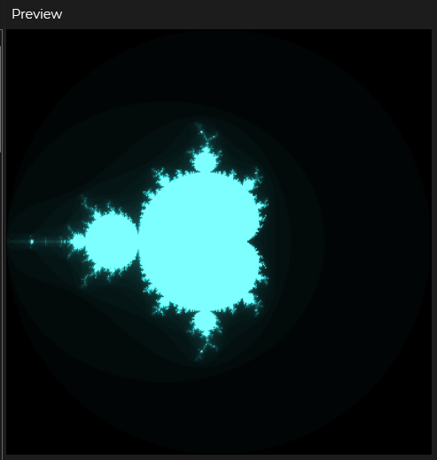

# Mandelbrot
This code was taken from https://www.youtube.com/watch?v=gECmGwD0DaI and translated into p5js. This uses quite a hefty amount of processing power to draw, to calculate the mandelbrot itself isn't quite long surprisingly.

## Preview

